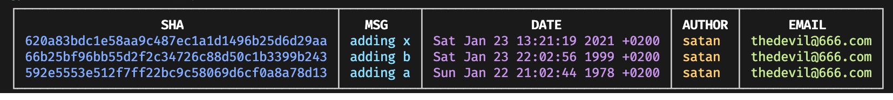

# restory
rewrite git history

# install
```bash
yarn add @tool3/restory
```

# api
## `ls`
show all commits

### example
```bash
restory ls
```

output:


## `redate`
rewrite commit|s date

### examples
- rewrite all commits to year to 1987   
```bash
restory redate 2021 1987
```
> NOTE: this will also automagically update the day and month

- rewrites a specific commit's day

```bash
restory redate 'Sat Jan 23' 'Sun Jan 24' -s '620a83bdc1e58aa9c487ec1a1d1496b25d6d29aa'
```

## `reauthor`
rewrite commit|s author name

### example
rewrite all commit author names to The Devil
```bash
restory reauthor 'The Devil'
```

## `remail`
rewrite commit|s author email

### example
rewrite all commit author email to 'thedevil@666.com'
```bash
restory remail 'thedevil@666.com'
```

# important usage notes
ATTENTION! THIS WILL REWRITE YOUR GIT HISTORY!
use at your own caution.

things you should know:
- every `restory` command entails in recreation of commit|s shas
- you will have to force push