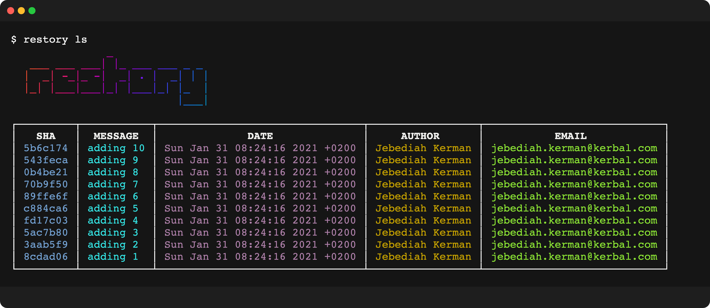

# restory 2.0

✅ Rewritten in TypeScript.  
✅ Added quiet mode.  
✅ super fast (uses git-filter-repo instead of git filter branch).  
✅ simple and intuitive api.  
✅ standalone - no 3rd party requirements (git-filter-repo included).

> [!CAUTION]
> THIS WILL REWRITE YOUR GIT HISTORY!  
> THIS OPERATION CANNOT BE REVERTED!  
> USE AT YOUR OWN RISK!

# install

```bash
npm install -g @tool3/restory
```

or

```bash
npx @tool3/restory <cmd> [args] [options]
```

things to know:

- `restory` uses it's own dist of [`git-filter-repo`](https://github.com/newren/git-filter-repo)  
  and therefore doesn't rely on you having it.
- by default it does **NOT** remove `origin` when done rewriting. (unless run with `--safe`).
- every `restory` command recreates the commit|s shas.
- you need to have a clean working directory.
- you will have to force push if using the same `origin`.
- when run without commit filter flag (`-s` || `-n` || `-r` - see [options](#options)) - the command will rewrite **ALL** commits with given input.

# api

every command in `restory` can either set a new value or replace an existing value.  
`restory <cmd> [optional-subject-to-replace] <value>`  
see more details for each command [below](#commands)  
| Command | Alias | Description |
|----------|-------|-------------------------------------------------------------------------------------------------------|
| `list` | `ls` | list all commits |
| `redate` | `rd` | rewrite commit(s) date |
| `reauthor`| `ra` | rewrite commit(s) author name |
| `remail` | `re` | rewrite commit(s) author email |
| `remsg` | `rm` | rewrite commit(s) message |
| `rewrite`| `rw` | rewrite multiple commit fields. This command is a combination of all of the commands above, and is controlled with flags |

# options

| Option            | Alias | Description                                                                                                                                                 | Default         |
| ----------------- | ----- | ----------------------------------------------------------------------------------------------------------------------------------------------------------- | --------------- |
| `sha`             | `s`   | rewrite a specific commit sha.                                                                                                                              |                 |
| `quiet`           | `q`   | don't log every commit change.                                                                                                                              |                 |
| `safe`            | `S`   | remove origin when done rewriting.                                                                                                                          |                 |
| `range`           | `r`   | range of commits to operate on.                                                                                                                             |                 |
| `truncate`        | `t`   | truncate output to minimum width.                                                                                                                           |                 |
| `number`          | `n`   | number of commits.                                                                                                                                          | 0 (all commits) |
| `committer`       | `c`   | include committer fields. For example: `author_date` will also include `committer_date` in the rewrite.                                                     | `true`          |
| `git-filter-repo` | `g`   | use [`git filter-repo`](https://github.com/newren/git-filter-repo) instead of `git filter-branch`. This method is extremely fast compared to filter-branch. | `true`          |

# commands

## `ls`

list all commits

```bash
restory ls
```



[](https://github.com/tool3/shellfie)

list last 5 commits

```bash
restory ls -n 5
```

list range of commits

```bash
restory ls -r 'c884ca6' '0b4be21'
```

## `redate`
rewrite all commits that has `2021` to year to `1984`

```bash
restory redate 2021 1984
```

rewrites a specific commit's day

```bash
restory redate 'Jan 23' 'Jan 24' -s '0b4be21'
```

rewrites the last 5 commits date to now

```bash
restory redate "$(echo `date`)" -n 5
```

## `reauthor`
rewrite all commit author names to `The Devil`
> [!CAUTION]
> IMPERSONATION IS STRICTLY PROHIBITED!  
> ANY IMPERSONATION WILL BE YOUR RESPONSIBILITY!  


```bash
restory reauthor 'The Devil'
```

rewrite last 5 commits author to `Jebediah Kerman`

```bash
restory reauthor 'Jebediah Kerman' -n 5
```

## `remail`
rewrite all commit author and committer email to `thedevil@666.com`
> [!CAUTION]
> IMPERSONATION IS STRICTLY PROHIBITED!  
> ANY IMPERSONATION WILL BE YOUR RESPONSIBILITY!  

```bash
restory remail 'thedevil@666.com'
```

## `remsg`

rewrite specific commit message

```bash
restory remsg 'this is the new commit msg' -s '620a83b'
```

rewrite `Moon` to `Mun` in all commit messages

```bash
restory remsg 'Moon' 'Mun'
```

## `rewrite`

rewrite commit message and replace date year `1987` to `1988` for the last 3 commits

```bash
restory rewrite -m 'this is the new commit msg' -d '1987' '1988' -n 3
```

rewrite `Moon` to `Mun` in all commit messages

```bash
restory rewrite -m 'Moon' 'Mun'
```

rewrite commit message, replace `t` to `z` in author name and set email to `new_value@world.com` in a range of commits

```bash
restory rewrite -m 'new message' -a 't' 'z' -e 'new_value@world.com' -r '8381e6a' '4110655'
```
